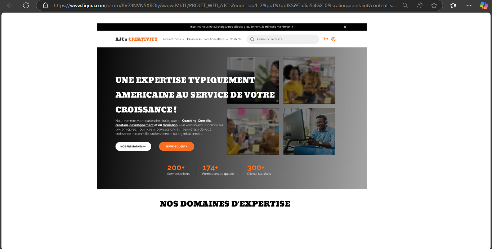
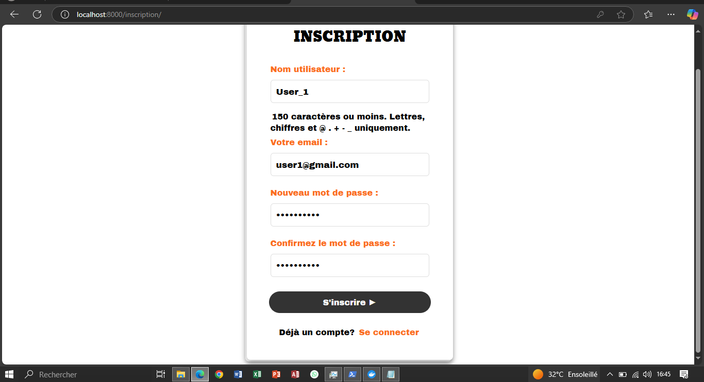
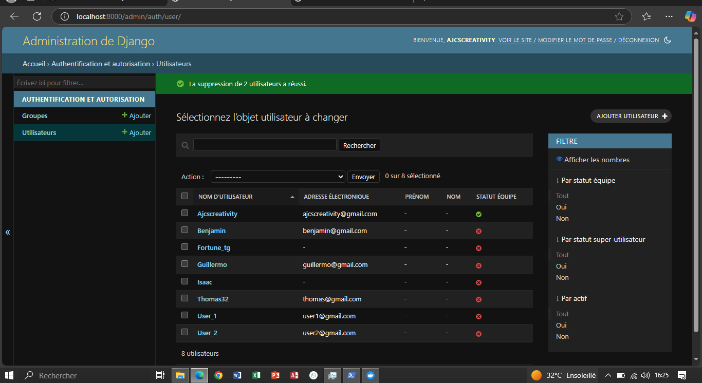

<h3 align="center" id="title">PROJET_WEB_AJCS – Module d’authentification Django. <br>Ajc's Creativity (Septembre → Décembre 2024)</h3>

<p id="description">Développement d'un module complet d’authentification pour un futur site web d'entreprise.
Objectif : proposer un système d’inscription et de connexion simple, sécurisé et fiable afin d’améliorer l’expérience utilisateur.</p>

<h2>Ma contribution</h2>

*   Conception du prototype desktop sur Figma (structure et flux utilisateur).
*   Mise en place complète du système d’authentification Django (inscription, connexion, déconnexion).
*   Personnalisation du modèle utilisateur (CustomUser).
*   Configuration de MySQL + Django ORM.
*   Dockerisation du projet (environnement Python + base MySQL).
*   Mise en place des vues, templates et tests unitaires.

<h3>Technologies utilisées dans ce projet :</h3>

*   Python 3.11
*   Django 5.1.3
*   MySQL
*   Docker & Docker Compose
*   Figma
*   HTML / CSS / Django Templates

<h2>Architecture du module</h2>

```
app_auth/
 ├── models.py        → CustomUser
 ├── forms.py         → Formulaire d’inscription
 ├── views.py         → Login / Register / Logout / Home
 ├── urls.py
 └── templates/
       ├── inscription.html
       ├── connexion.html
       └── accueil.html
```

<h2>Aperçu</h2>

prototype Figma (Accueil)

 <br>

Interfaces

 <br>

 <br>

<h2>Démarrer le projet (Docker) :</h2>

<p>1. Commande :</p>

```
docker-compose up --build
```

<p>2. Puis accéder à :</p>

```
http://localhost:8000/
```

<h2>Fonctionnalités principales</h2>

*   Création de compte utilisateur (CustomUser)
*   Connexion sécurisée (hashing Django)
*   Déconnexion
*   Protection CSRF
*   Tests unitaires pour la création de compte


<h3>Lien prototype Figma (page accueil):</h3>


https://www.figma.com/design/8V28NVN5XROlyAwgwrMkTL/PROJET_WEB_AJC
  

<h2>🛡️ License</h2>

Projet soumis à la [License MIT](LICENSE)